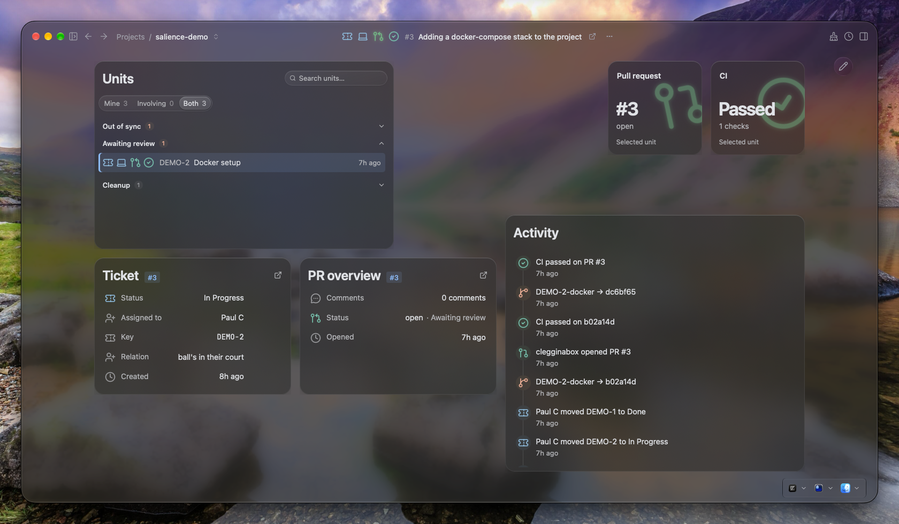
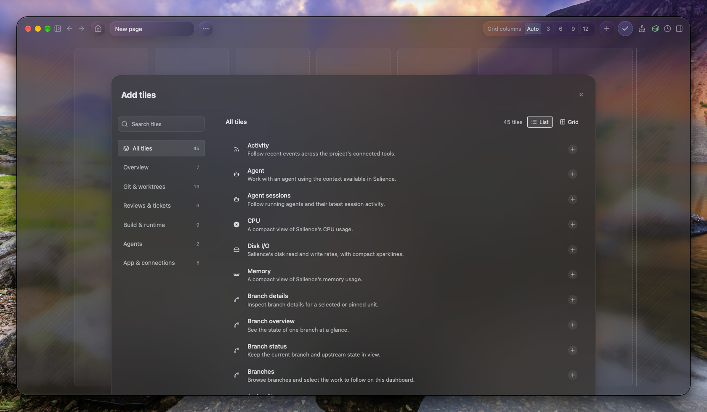

# Salience

**Home Assistant for developer tools.**

Salience is a macOS and Linux app that watches your branches, tickets, pull requests, builds, observability and local environment, and works out how they fit together: the ticket behind a branch, the PR it became, the image that PR built and where that image is running. That's how it catches what no single tool can see: a merged PR whose ticket is still open, branches and worktrees you no longer need, the commits that went out in the last deploy.

It holds what your tools don't. Drop a spec, screenshot or log onto a ticket, PR or project; pin a note to anything; attach the Slack message where the decision was made. They join the same picture.

Create your own dashboards, keep it on a second screen for a quiet overview, dig into the details when you need them, or give your agent the same joined-up context.

> Salience is in alpha. Expect rough edges.

[Downloads](https://clegginabox.github.io/salience-macos/download) · [Releases](https://github.com/clegginabox/salience-macos/releases) · [All documentation](https://clegginabox.github.io/salience-macos/docs/)

## Start here

- **[Get started](https://clegginabox.github.io/salience-macos/docs/install)** — install Salience, add a project and connect your first tool.
- **[Concepts and terminology](https://clegginabox.github.io/salience-macos/docs/concepts)** — understand entities, correlations, units of work, situations, tiles and pages through a worked example.
- **[Connect your tools](https://clegginabox.github.io/salience-macos/docs/connect-your-tools)**

## One piece of work, across several tools

The Docker setup ticket, its branch, pull request and build checks, brought together in Salience.

[Follow the example](https://clegginabox.github.io/salience-macos/docs/concepts) · [More screenshots](https://clegginabox.github.io/salience-macos/gallery)

## Connectors

| Connector | What it brings in |
| --- | --- |
| Git | Local branches and worktrees, read straight from disk |
| [GitHub](https://clegginabox.github.io/salience-macos/docs/integrations/github) | Pull requests, reviews, conversation and GitHub Issues |
| [CI](https://clegginabox.github.io/salience-macos/docs/integrations/ci) | Check results for your pull requests and branches, from GitHub Actions and any CI that reports to GitHub |
| [Jira](https://clegginabox.github.io/salience-macos/docs/integrations/jira) | Tickets from the boards you pick |
| [Sentry](https://clegginabox.github.io/salience-macos/docs/integrations/sentry) | Unresolved issues, with stack traces mapped onto your code |
| Slack | Messages that mention you, ready to attach to a ticket, PR or project |
| [AWS](https://clegginabox.github.io/salience-macos/docs/integrations/aws) | ECR images, ECS clusters, task definitions and running tasks |
| [Docker](https://clegginabox.github.io/salience-macos/docs/integrations/docker) | Compose services and their containers, with start, stop and restart |

Every connector is read-only, except the Docker controls, which start and stop your local containers when you ask. GitLab and Linear are coming soon.

## Build your own dashboards

Pick from over [45 tiles](https://clegginabox.github.io/salience-macos/docs/reference/tiles) to build a page around the work you're doing: units of work, branches and worktrees, reviews and tickets, builds and containers, agents and app health.

## Explore further

- [Integrations](https://clegginabox.github.io/salience-macos/docs/integrations/) 
- [Using Salience](https://clegginabox.github.io/salience-macos/docs/using/) — workflow guides, including outlines being developed.
- [MCP server](https://clegginabox.github.io/salience-macos/docs/mcp) 
- [Code Graph](https://clegginabox.github.io/salience-macos/docs/code-graph) 
- [Privacy and security](https://clegginabox.github.io/salience-macos/docs/privacy) — understand where your data lives and how to inspect connections.
- [About Salience](https://clegginabox.github.io/salience-macos/docs/about)

## Help and feedback

For a problem with the app, [open an issue](https://github.com/clegginabox/salience-macos/issues) with your platform, app version and steps to reproduce it. Remove credentials and private project information from logs and screenshots.

For questions and discussion, [join the Discord](https://discord.gg/NErgbMHJr).

## This repository

This repository contains Salience's documentation website and release distribution.

Documentation changes can be submitted as pull requests here.

<a href="https://www.star-history.com/?repos=clegginabox%2Fsalience-macos&type=date&legend=top-left">
 <picture>
   <source media="(prefers-color-scheme: dark)" srcset="https://api.star-history.com/chart?repos=clegginabox/salience-macos&type=date&theme=dark&legend=top-left" />
   <source media="(prefers-color-scheme: light)" srcset="https://api.star-history.com/chart?repos=clegginabox/salience-macos&type=date&legend=top-left" />
   
 </picture>
</a>
