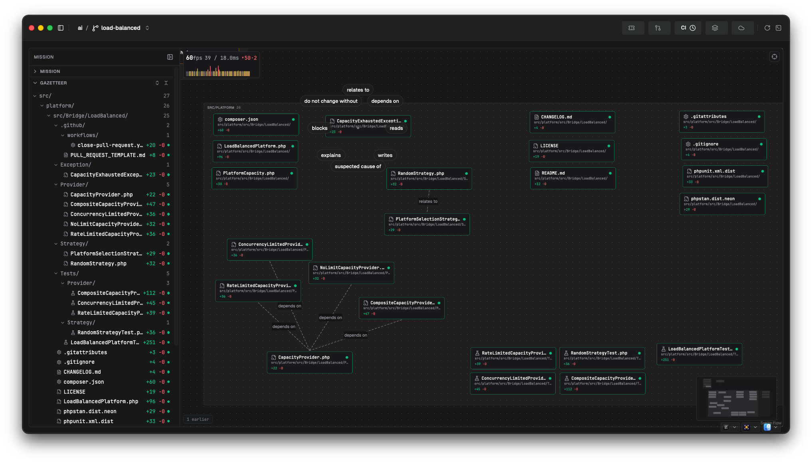
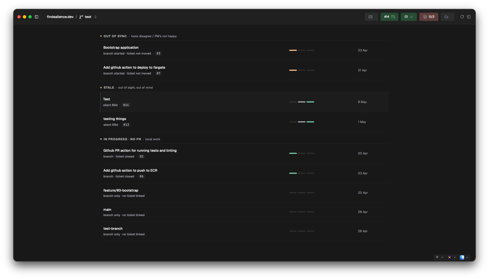

# Salience

**Your work, as a living map.**

Salience is a macOS desktop app for developers. It follows your git branches across the tools they touch — PRs, tickets, CI, containers, deploys — joins what it finds into one correlated graph on your machine, and renders it as a calm, glanceable map that lives on your second monitor.

[**Download for macOS →**](https://github.com/clegginabox/salience-macos/releases/latest) · [**Documentation →**](https://clegginabox.github.io/salience-macos/docs/) · [**Gallery →**](https://clegginabox.github.io/salience-macos/gallery) · [**Discord →**](https://discord.gg/NErgbMHJr)

## What it does

- **A living map, not a dashboard** — branches, PRs, tickets and CI laid out as places with stable positions, so you always know where to look. Watch your AI agents move as they work.
- **Calm by default** — no inbox, no notifications, no modals. A derivation engine promotes what matters into *situations*, each with a loudness matched to how urgently it needs you.
- **Readable by your agents** — the same joined graph ships with an [MCP server](https://clegginabox.github.io/salience-macos/docs/mcp). Point Claude, Codex, or Cursor at it and ask "what's my stand-up?" instead of letting them scrape five tabs.
- **Verifiably local** — an encrypted database on your machine, credentials in the macOS Keychain, and a built-in network monitor showing every outbound request the app makes. [You're the customer, not the product.](https://clegginabox.github.io/salience-macos/docs/privacy)

## Getting started

1. [Download the latest release](https://github.com/clegginabox/salience-macos/releases/latest) — macOS 13+, Apple Silicon and Intel.
2. Add a project (any local git repository).
3. [Connect a tool](https://clegginabox.github.io/salience-macos/docs/connect-your-tools) — GitHub, Jira, AWS, Sentry, Docker — and watch the map fill in.

Full walkthrough: [First run →](https://clegginabox.github.io/salience-macos/docs/getting-started)

> **Pre-release:** Salience is shipping early to a small group of users. Expect rough edges — please report what you find on the [issues page](https://github.com/clegginabox/salience-macos/issues).

## This repository

This repo hosts the documentation site (built with VitePress from [`docs/`](docs/)) and the release distribution for Salience.
