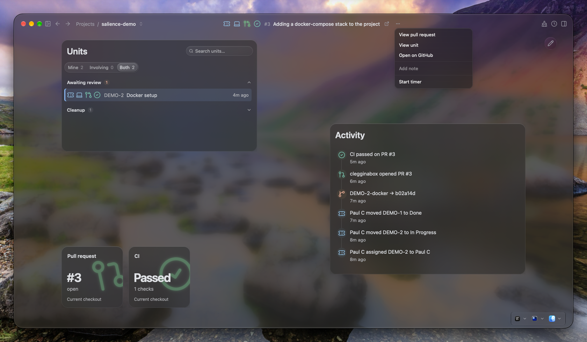

# Salience

**Home Assistant for developer tools.**

Salience is a macOS and Linux app that brings together your branches, tickets, pull requests, builds and local environment. It connects related work and lets you arrange it into pages of tiles.

Keep it visible for a quiet overview, explore the details when you need them, or give your agent access to the same context.

> Salience is in alpha and free to use during alpha. Expect rough edges.

## Start here

- **[Get started](https://clegginabox.github.io/salience-macos/docs/install)** — install Salience, add a project and connect your first tool.
- **[Concepts and terminology](https://clegginabox.github.io/salience-macos/docs/concepts)** — understand entities, correlations, units of work, situations, tiles and pages through a worked example.
- **[Connect your tools](https://clegginabox.github.io/salience-macos/docs/connect-your-tools)** — bring in information from the tools you use.

[Downloads](https://clegginabox.github.io/salience-macos/download) · [Releases](https://github.com/clegginabox/salience-macos/releases) · [All documentation](https://clegginabox.github.io/salience-macos/docs/)

## One piece of work, across several tools

The Docker setup ticket, its branch, pull request and build checks, brought together in Salience. The page combines a units list, activity and status tiles around the same work.

[Follow the example](https://clegginabox.github.io/salience-macos/docs/concepts) · [More screenshots](https://clegginabox.github.io/salience-macos/gallery)

## Explore further

- [Integrations](https://clegginabox.github.io/salience-macos/docs/integrations/) — find the tools you use and their connection guides.
- [Using Salience](https://clegginabox.github.io/salience-macos/docs/using/) — workflow guides, including outlines being developed.
- [MCP server](https://clegginabox.github.io/salience-macos/docs/mcp) — give a compatible agent access to the same joined context.
- [Code Graph](https://clegginabox.github.io/salience-macos/docs/code-graph) — explore the code behind a route.
- [Privacy and security](https://clegginabox.github.io/salience-macos/docs/privacy) — understand where your data lives and how to inspect connections.
- [About Salience](https://clegginabox.github.io/salience-macos/docs/about) — why the project exists.

## Help and feedback

For a problem with the app, [open an issue](https://github.com/clegginabox/salience-macos/issues) with your platform, app version and steps to reproduce it. Remove credentials and private project information from logs and screenshots.

For questions and discussion, [join the Discord](https://discord.gg/NErgbMHJr).

## This repository

This repository contains Salience's documentation website and release distribution.

Documentation changes can be submitted as pull requests here.

<a href="https://www.star-history.com/?repos=clegginabox%2Fsalience-macos&type=date&legend=top-left">
 <picture>
   <source media="(prefers-color-scheme: dark)" srcset="https://api.star-history.com/chart?repos=clegginabox/salience-macos&type=date&theme=dark&legend=top-left" />
   <source media="(prefers-color-scheme: light)" srcset="https://api.star-history.com/chart?repos=clegginabox/salience-macos&type=date&legend=top-left" />
   
 </picture>
</a>
